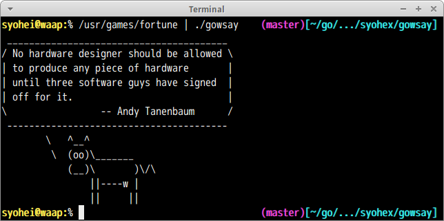
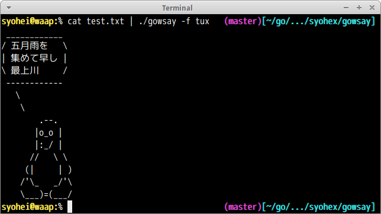

# gowsay

[cowsay](https://en.wikipedia.org/wiki/Cowsay) implementation in Golang.

## Screenshot



## Installation

```
% go get -u github.com/syohex/gowsay
```

## Usage

```
% gowsay -h
Usage of gowsay:
  -b, --borg=false: borg eyes
  -W, --columns=40: columns
  -d, --dead=false: dead eyes and tongue
  -g, --greedy=false: greedy eyes
  -l, --list=false: list cow files
  -p, --paranoid=false: paranoid eyes
  -s, --stoned=false: stoned eyes and tongue
      --think=false: think version
  -t, --tired=false: tired eyes
  -f, --type="default": specify cow file
  -w, --wired=false: wired eyes
  -y, --young=false: young eyes
```

## Full-Width characters support

gowsay supports full-width chracters such as Hiragana, Kanji.


